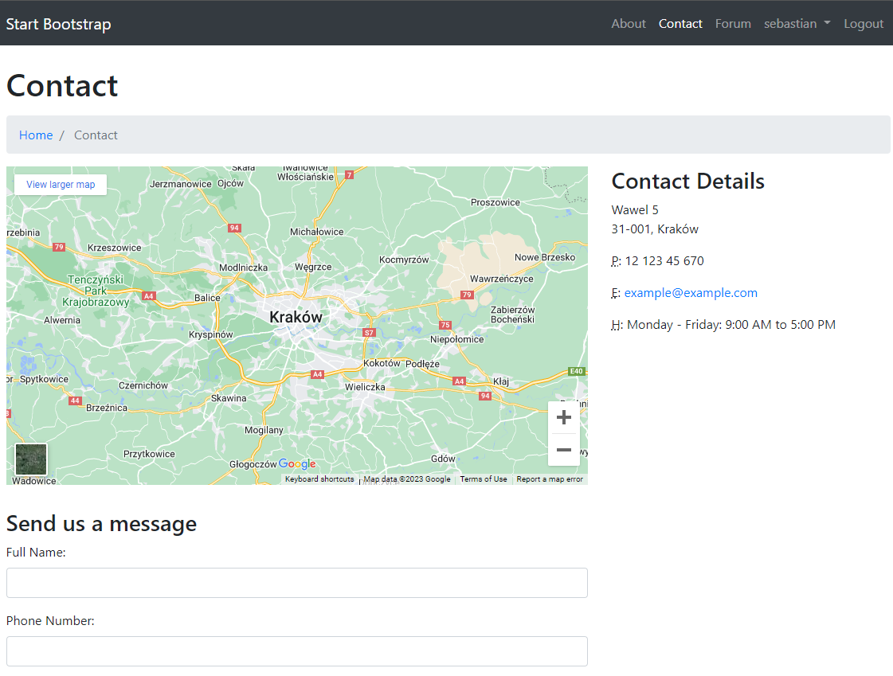

# Forum website

Basic forum CRUD app with user register/login, profile edit, post add/update. Created to learn Django.

## Technology
<ul>
<li>Python</li>
<li>Django</li>
<li>Bootstrap</li>
<li>sqlite</li>
</ul>

## Screenshots
&nbsp;
&nbsp;
&nbsp;
&nbsp;

